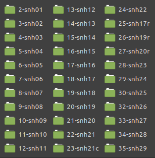
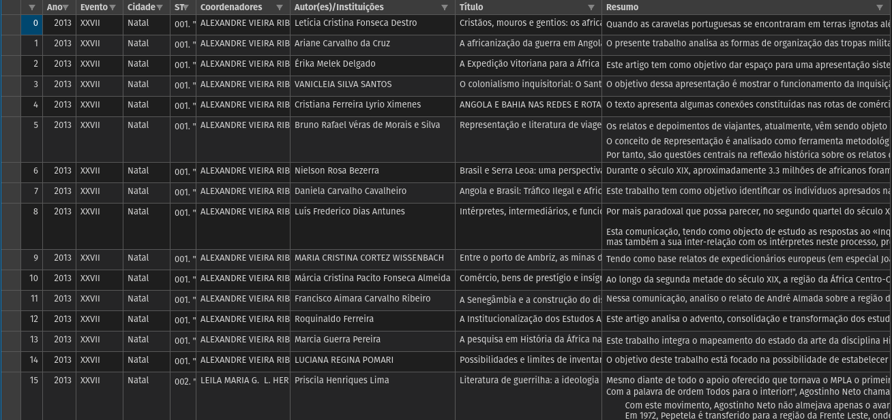

--- 
title: "Repositório Digital das Humanidades (PT-BR)"
author:
- Leonardo F. Nascimento^[UFBA - Laboratório de Humanidades Digitais, leofn@ufba.br]
- Eric Brasil^[UNILAB - LABHDUFBA, profericbrasil@unilab.edu.br]
- Tarssio Barreto^[UFBA - Laboratório de Humanidades Digitais, tarssioesa@gmail.com ]
- Vítor Mussa^[UFRJ/PPGSA/DTA - LABHDUFBA, vtrmussa@gmail.com]
- Daniel Mendes^[UFRJ - PATHS, daniel_mnds34@hotmail.com]
- Outro^[UFRJ - PPGCS, vmussa@gmail.com]
date: "`r Sys.Date()`"
output: pdf_document
documentclass: book
bibliography:
- book.bib
- packages.bib
biblio-style: apalike
link-citations: yes
description: Obra colaborativa com scripts e dados da produção intelectual brasileira em todos os campos das humanidades coletadas e agrupadas através de técnicas computacionais de extração autoamtizada (web scraping)
site: bookdown::bookdown_site

---

# Apresentação

<style>
body {
text-align: justify}
</style>

A ideia desta obra foi reunir esforços de diferentes pesquisadores e instituições na elaboração de scripts para coletar - de modo automatizado - a produção intelectual dos principais congressos e eventos das áreas das humanidades. 

Além disso, nós tivemos como objetivo mais amplo enfatizar a importância do desenvolvimento de habilidades computacionais por parte dos pesquisadores em todos os campos das humanidades.

Os scripts, as bases de dados e todos os documentos estão disponíveis e poderão ser baixados com apenas um clique. O acervo servirá para a realização de investigações sobre os mais variados aspectos e ampliar, com isso, o conhecimento sobre a produção acadêmica, científica e intelectual do Brasil das ciências humanas e sociais ao longo de décadas. 

Para o lancamento, nós escolhemos o [Dia Internacional das Humanidades Digitais](https://dhcenternet.org/initiatives/day-of-dh/2021) em 29/04/2021.

Ao compartilhar nas redes, pedimos que usem a hashtag **#dayofdh21**

<center>

{width=35%}

</center>


# Webscraping e ciências sociais

## Por que automatizar?

## Como começar?

## Prós e contras

# Pré-requisitos

## R e Rstudio

## Python

# ANPUH

## O que é ANPUH?

A [Associação Nacional de História, Anpuh](https://anpuh.org.br/index.php), fundada em 1961, inicialmente destinada aos docentes de cursos de graduação e pós-graduação. Em 1993, a ANPUH ampliou sua base para todoa os profissionais de história.

>A cada dois anos, a ANPUH realiza o Simpósio Nacional de História, o maior e mais importante evento da área de história no país e na América Latina^[[Anpuh-Quem somos](https://anpuh.org.br/index.php/quem-somos)].

Desenvolvemos scripts diferentes para dois tipos de conjuntos de dados relacionados à Associação Nacional de História.

- Anais-Anpuh: script para raspagem de todos os trabalhos publicados nos Anais dos Simpósio Nacionais de História entre 1963 e 2017, disponíveis no site da Anpuh.

- anpuh-scraper: script para raspagem dos resumos (e demais informações) de todos os trabalhos aprovados para todos os simpósios temáticos dos SNH nos aos de 2013, 2015, 2017 e 2019.

## Anais-Anpuh

[Clique aqui para acessar o repositório no Github](https://github.com/LABHDUFBA/Anais-Anpuh).

### Scripts de raspagem

Esse script realiza a raspagem dos trabalhos em PDF de todos os Simpósios Nacionais da Anpuh entre 1963 até 2017, disponíveis atualmente na site da associação, que podem ser [acessados aqui](https://anpuh.org.br/index.php/documentos/anais).

Escrito em [Python 3.8](https://www.python.org/), o script utiliza as seguintes bibliotecas e módulos

- **urllib.requests**: módulo do Python para acessar urls. [Saiba mais.](https://docs.python.org/pt-br/3/library/urllib.request.htmll)
- **os**: módulo do Python que permite manipular funções do sistema operacional. [Saiba mais.](https://docs.python.org/pt-br/3/library/os.html)
- **bs4**: [Beautiful Soup](https://www.crummy.com/software/BeautifulSoup/bs4/doc/) é uma biblioteca Python para extrair  dados de arquivos HTML e XML.
- **re**: [Regular Expressions](https://docs.python.org/pt-br/3/library/re.html) é um módulo do Python para operar com expressões regulares.
- **pandas**: [Pandas](https://pandas.pydata.org/) é uma biblioteca escrita em Python para manipulação e análise de dados.
- **wget**: [Wget](https://pypi.org/project/wget/) é uma biblioteca escrita em Python para realizar downloads. 

O script tem o seguinte funcionamento quando executado:

- Cria pasta para salvar os PDFs, após verificar se a mesma não existe no local: `Anais Anpuh> pdf` utilizando módulo `os`.
- Acessa a URL dos Anais com a biblioteca `urllib` e realiza a análise do HTML da mesma com a biblioteca `BeautifulSoup`;
- Cria uma lista de eventos a partir da página principal;
- Acessa as páginas de cada evento contidas na lista criada anteriormente através de uma iteração;
- Em cada item da lista de eventos, o script busca todos os papers da primeira página e cria uma nova lista. Nessa lista de papers de uma dada página o script realizará as seguintes ações:
	- encontrar as informações de cada paper;
	- inclui essas informações em uma lista (que depois gerará um CSV com os dados);
	- busca se há pdf disponível e se ele não é repetido faz download do PDF
	- Após realizar essas ações para todos os itens de uma página, busca a próxima página de papers do evento, se não houver, passa para o próximo evento e repete as ações em um _loop_ até o último evento disponível.

### Dados

O script retorna para o usuário **todos os pdfs disponíveis em todas as páginas de todos os Simpósios Nacionais da Anpuh desde 1963 até 2017**. São criadas pastas com o número de cada evento para o armazenamento dos arquivos em PDF.



É importante notar que muitos papers não estão com pdf disponível no site, assim como nas edições mais antigas encontramos arquivos que contém vários papers num único PDF.

O script também gera um arquivo **CSV** (*comma-separated values*) contendo os seguintes valores para cada paper: Autor(es)/Instituições,Título, Tipo, Evento, Ano, Link do Arquivo. Esse arquivo pode ser aberto como uma planilha e trabalhado em banco de dados.


## anpuh-scraper

[Clique aqui para acessar o repositório no Github](https://github.com/LABHDUFBA/anpuh-scraper).

### Scripts de raspagem

*Raspador dos resumos dos Simpósios Nacionais de História da [Associação Nacional de História - Anpuh](https://anpuh.org.br). O programa raspa todos os resumos dos SNH 27, 28, 29 e 30, respectivamente dos anos de 2013, 2015, 2017 e 2019*
Escrito em [Python 3.8](https://www.python.org/), o script utiliza as seguintes bibliotecas e módulos

- **urllib.requests**: módulo do Python que ajuda a acessar urls.
[Saiba mais.](https://docs.python.org/pt-br/3/library/urllib.request.htmll)
- **bs4**: [Beautiful Soup](https://www.crummy.com/software/BeautifulSoup/bs4/doc/) é uma biblioteca Python para extrair  dados de arquivos HTML e XML.
- **pandas**: [Pandas](https://pandas.pydata.org/) é uma biblioteca escrita em Python para manipulação e análise de dados. 

O script tem o seguinte funcionamento quando executado:

Pergunta ao usuário que ano pretende raspar e se deseja incluir um novo ano à lista. 
Após a criação da lista com os anos escolhidos pelo usuário, o script acessa cada uma das páginas com as listas dos STs nos sites de cada evento;
Acessa cada ST, encontra os dados de todos os resumos e passa para o ST seguinte;
Após terminar um ST, passa para o próximo evento e executa as mesmas função;
Todos os dados são inseridos em um DataFrame em Pandas e ao final são salvos no formato CSV.

### Dados

O script retorna para o usuário um **CSV (*comma-separated values*) com os dados de todos os trabalhos aceitos nos Simpósio Temáticos dos SNH 27, 28, 29 e 30**.

O CSV contém as seguintes variáveis para cada resumo:

`Ano, Evento, Cidade, ST, Coordenadores, Autor(es)/Instituições, Título, Resumo`

Esse arquivo pode ser aberto como uma planilha e trabalhado em banco de dados.



# ANPOCS

## O que é a ANPOCS?

A [Associação Nacional de Pós-Graduação e Pesquisa em Ciências Sociais (ANPOCS)](http://anpocs.com/) é uma entidade de direito privado sem fins lucrativos que reúne centenas de centros de pós-graduação e de pesquisa em antropologia, ciência política, relações internacionais e sociologia de todo o Brasil. Ela é formada, portanto, por instituições, em vez de pesquisadores individuais.

A associação organiza os _Encontros Anuais da ANPOCS_, que consistem em congressos cujo número médio de participantes é de 1500 pesquisadores. Esses encontros estão entre os fóruns mais relevantes para as ciências sociais no Brasil.

Diante disso, desenvolvemos o `anpocs-scraper` – [disponível aqui](https://github.com/vmussa/anpocs-scraper) –, um raspador que permite coletar de forma automatizada os dados dos resumos dos trabalhos apresentados nos encontros de 2019, 2020 e, futuramente, 2021. O raspador expressa mais uma iniciativa que busca contribuir para uma ciência aberta e transparente, facilitando o acesso aos dados dos congressos e contribuindo para a preservação da memória das ciências sociais brasileiras.

## Script de raspagem

### anpocs-scraper


O `anpocs-scraper` é um raspador dos dados dos [Encontros Anuais da ANPOCS](http://anpocs.com/index.php/encontros/apresentacao) escrito em Python. Atualmente o código permite coletar:

* os dados de todos os resumos dos trabalhos apresentados em GT's e SPG's do [44º Encontro Anual da ANPOCS](https://www.anpocs2020.sinteseeventos.com.br/)

* os dados de todos os resumos dos trabalhos apresentados em ST's e SPG's do [43º Encontro Anual da ANPOCS](http://anpocs.com/index.php/43-encontro-anual-2019/2750-encontros-anuais/43-encontro/2301-resumos-sts-e-spgs)

### Instalação e modo de uso

Para instalar o raspador basta clonar o repositório, [que se encontra aqui](https://github.com/vmussa/anpocs-scraper), e instalar suas dependências:

```
git clone https://github.com/vmussa/anpocs-scraper
cd anpocs-scraper
python -m venv .venv && source .venv/bin/activate
pip install -r requirements.txt
```

Para rodar o raspador, continue no repositório clonado e execute o código `main.py` com o Python:

```
python src/main.py
```

> Atenção &#8594; **para realizar esse procedimento, você precisa instalar o Google Chrome e o ChromeDriver**: [Clique aqui](https://chromedriver.chromium.org/getting-started) para ler um tutorial sobre como instalar o ChromeDriver.

### Em breve

Futuramente o raspador abarcará todos os GT's e SPG's do encontro 45, cujos resumos dos trabalhos estarão disponíveis [aqui](https://www.anpocs2021.sinteseeventos.com.br/). Além disso, ele contará com um módulo de limpeza dos dados que fará o pré-processamento para a análise qualitativa e/ou computacional.

## Dados

O programa exporta, para cada edição do congresso, uma tabela no formato CSV com as seguintes informações de cada trabalho apresentado:

> `autores`, `titulo`, `resumo`, `sessao`, `id_evento`

A imagem abaixo ilustra o formato de uma das tabelas:


# ComPos

## O que é a Compós?

## Script de raspagem

## Dados

# Referências Bibliográficas

AAAAAAAAAAAAAAA

# Sobre os autores

## Leo
 
## Eric Brasil (IHLM/UNILAB)

Professor do curso de licenciatura em História e professor do Bacharelado Interdisciplinar em Humanidades no Instituto de Humanidades e Letras da Universidade da Integração Internacional da Lusofonia Afro-brasileira (IHL-UNILAB), campus dos Malês, Bahia. 

Autor do livro A Corte em Festa: experiências negras em carnavais do Rio de Janeiro (1879-1888) (Editora Prismas, 2016). 
Doutor (2016) e Mestre (2011) pelo Programa de Pós-Graduação em História Social da Universidade Federal Fluminense. 

Vencedor do primeiro lugar no Concurso de Monografias Silvio Romero de 2011 e do segundo lugar em 2020, promovido pelo Centro Nacional de Folclore e Cultura Popular. 

Pesquisador do Laboratório de Humanidades Digitais da UFBA. Membro do GT Nacional Emancipações e Pós-Abolição da Anpuh. 
Tem experiência na área de História Social da Cultura, Humanidades e História Digital, Abolição da escravidão e o Pós-Abolição no Brasil e no Caribe, atuando principalmente nos seguintes temas: Carnaval, Cidadania, História Transnacional, Diáspora Africana, História das Afro-Américas, Hemerotecas e arquivos digitais, métodos digitais de pesquisa, linguagem de programação para a pesquisa em História, web scraping. 

Foi professor de ensino fundamental, médio e pré-vestibular no Rio de Janeiro entre 2007 e 2017.

Currículos e redes acadêmicas

[Webpage](https://ericbrasiln.github.io) - [Lattes](http://lattes.cnpq.br/6853705640900524) - [Orcid]("https://orcid.org/0000-0001-5067-8475) - [ResearchGate](https://www.researchgate.net/profile/Eric_Brasil) - [Academia.edu](https://unilab.academia.edu/EricBrasil)

## Vítor Mussa (DTA/PPGSA/UFRJ e LABHDUFBA/UFBA)

Mestrando do Programa de Pós-Graduação em Sociologia e Antropologia (PPGSA) da Universidade Federal do Rio de Janeiro (UFRJ).

É membro do grupo de pesquisa Desenvolvimento, Trabalho e Ambiente ([DTA-UFRJ](https://www.nucleodta.org/inicio)) e do Laboratório de Humanidades Digitais da Universidade Federal da Bahia ([LABHD-UFBA](http://www.labhd.ufba.br/)).

Currículos e redes acadêmicas

[Webpage](https://vmussa.github.io) - [Lattes](http://lattes.cnpq.br/2934187748254130) - [ResearchGate](https://www.researchgate.net/profile/Vitor-Mussa-2) - [LinkedIn](https://www.linkedin.com/in/vmussa/) - [Twitter](https://twitter.com/vitormussa)

## Tarssio

## Daniel Mendes (PATHS/UFRJ)

Graduando no curso de Bacharelado em Ciências Sociais do Instituto de Filosofia e Ciências Sociais (IFCS) da Universidade Federal do Rio de Janeiro (UFRJ).

É membro do grupo de pesquisa Núcleo de Pesquisa em Estratificação e Trajetórias Sociais ([PATHS](https://www.facebook.com/paths.research/)).

Currículos e redes acadêmicas

[Lattes](http://lattes.cnpq.br/9834413442426550) - [LinkedIn](https://www.linkedin.com/in/daniel-mendes-251212176/) - [Twitter](https://twitter.com/danielmnds34)

## Outro

## Ajude o projeto! 

<center>

{width=35%}

</center>


