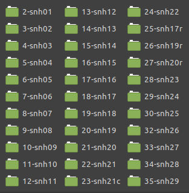

## O que é ANPUH?

A [Associação Nacional de História, Anpuh](https://anpuh.org.br/index.php), fundada em 1961, inicialmente destinada aos docentes de cursos de graduação e pós-graduação. Em 1993, a ANPUH ampliou sua base para todos os profissionais de história.

>A cada dois anos, a ANPUH realiza o Simpósio Nacional de História, o maior e mais importante evento da área de história no país e na América Latina [[Anpuh-Quem somos](https://anpuh.org.br/index.php/quem-somos)].

Desenvolvemos scripts diferentes para dois tipos de conjuntos de dados relacionados à Associação Nacional de História.

- Anais-Anpuh: script para raspagem de todos os trabalhos publicados nos Anais dos Simpósio Nacionais de História entre 1963 e 2017, disponíveis no site da Anpuh.

- Resumos-anpuh CLI: é uma interface de linha de comando (CLI) escrita em Python com objetivo de raspar e organizar os Resumos dos Simpósios temáticos dos SNH dos anos de 2013, 2015, 2017, 2019 e 2021.

## Anais-Anpuh

[](https://www.researchgate.net/publication/341804201_Script_Anais-Anpuh)
 [](https://www.python.org/) [](https://lbesson.mit-license.org/)

*Projeto de script para web scraping da página de [Anais da Associação Nacional de História - Anpuh](https://anpuh.org.br/index.php/documentos/anais).
 Parte de projeto de História Digital desenvolvido no colegiado do curso de Licenciatura em História (CCLHM) da Unilab, campus dos Malês, sob coordenação do professor [Eric Brasil](https://ericbrasiln.github.io/) em parceria com o [Laboratório de Humanidades Digitais da Ufba](http://labhd.ufba.br/).*

*O Script Anais-Anpuh realiza a raspagem dos papers em pdf de todos os Simpósios Nacionais da Anpuh entre 1963 até 2017 (disponíveis atualmente na site).*
___

**A ferramenta foi desenvolvida apenas para pesquisas acadêmicas, sem fins lucrativos.**
___

### Instalação

Para executar o Script Anais-Anpuh, vc precisa acessar a pasta da ferramenta no [GitHub](https://github.com/LABHDUFBA/Anais-Anpuh). Clone ou faça download do repositório e salve na pasta que deseja que os resultados e seus respectivos arquivos sejam armazenados. Antes de executar o script, é preciso preparar seu computador, como mostramos abaixo.

#### Python

A ferramenta consiste num script escrito em [Python 3.8](https://www.python.org/). Esta é uma linguagem de programação que te permite trabalhar rapidamente e integrar diferentes sistemas com maior eficiência.
Para executar o arquivo .py é preciso instalar o Python3 em seu computador.

[Clique aqui](https://python.org.br/instalacao-windows/) para um tutorial de instalação do Python no Windows, [clique aqui](https://python.org.br/instalacao-linux/) para Linux e [clique aqui](https://python.org.br/instalacao-mac/)
para Mac.

Após a instalação, vc pode executar o arquivo .py direto do prompt de comando do Windows ou pelo terminal do Linux, ou utilizar as diversas [IDE](https://pt.wikipedia.org/wiki/Ambiente_de_desenvolvimento_integrado) disponíveis.

Exemplo de como executar utilizando o terminal do Linux, após instalar o Python3.8:

1. Acesse o diretório em que o arquivo .py está salvo:
   ```sh
   $ cd user/local
   ```
1. Instale as bibliotecas requeridas:
   ```sh
   $ pip3 install -r requirements.txt
   ```
1. Execute o arquivo usando Python3.8
   ```sh
   $ python3.8 script-anais-anpuh.py
   ```


##### Bibliotecas e módulos

- **urllib.requests**: módulo do Python que ajuda a acessar urls.
[Saiba mais.](https://docs.python.org/pt-br/3/library/urllib.request.htmll)
- **os**: módulo do Python que permite manipular funções do sistema operacional.
[Saiba mais.](https://docs.python.org/pt-br/3/library/os.html)
- **bs4**: [Beautiful Soup](https://www.crummy.com/software/BeautifulSoup/bs4/doc/) é uma biblioteca Python para extrair
 dados de arquivos HTML e XML.
- **re**: [Regular Expressions](https://docs.python.org/pt-br/3/library/re.html) é um módulo do Python para operar com expressões regulares.
- **pandas**: [Pandas](https://pandas.pydata.org/) é uma biblioteca escrita em Python para manipulação e análise de dados.
- **wget**: [Wget](https://pypi.org/project/wget/) é uma biblioteca escrita em Python para realizar downloads. 

### Resultados

O script retorna para o usuário **todos os pdfs disponíveis em todas as páginas de todos os Simpósios Nacionais da Anpuh desde 1963 até 2017**. São criadas pastas com o número de cada evento para o armazenamento dos arquivos em PDF.



É importante notar que muitos papers não estão com pdf disponível no site, assim como nas edições mais antigas encontramos arquivos que contém vários papers num único PDF.

O script também gera um arquivo **CSV** (*comma-separated values*) contendo os seguintes valores para cada paper: Autor(es)/Instituições,Título, Tipo, Evento, Ano, Link do Arquivo. Esse arquivo pode ser aberto como uma planilha e trabalhado em banco de dados.


O script está funcionando perfeitamente. Qualquer alteração no site percebida pelos usuários ou sugestões de aprimoramento são bem vindas.

#### Download dos dados

[Se preferir baixar a base dos PDFs sem usar o código clique aqui](http://u.pc.cd/hhFotalK).

### Licença

MIT licensed

Copyright (C) 2020 [Eric Brasil](https://github.com/ericbrasiln), [Gabriel Andrade](https://github.com/gabrielsandrade), [Leonardo F. Nascimento](https://github.com/leofn/), [Vitor Mussa](https://github.com/vmussa), [LABHD-UFBA](http://labhd.ufba.br/)

---

## Resumos-anpuh CLI

[](https://doi.org/10.5281/zenodo.5252128)

`resumosanpuh` é uma interface de linha de comando (CLI) escrita em Python com objetivo de raspar e organizar os Resumos dos Simpósios Anuais da História da [Associação Nacional de História - Anpuh](https://anpuh.org.br).

O programa raspa todos os resumos dos SNH 27, 28, 29, 30 e 31, respectivamente dos anos de 2013, 2015, 2017, 2019 e 2021 e organiza em um arquivo CSV.

Foi construído a partir do script _Anpuh Scraper_, [DOI 10.5281/zenodo.5168720](https://doi.org/10.5281/zenodo.5168720), disponível [aqui](https://github.com/LABHDUFBA/anpuh-scraper).

Desenvolvido no âmbito do [Laboratório de Humanidades Digitais da UFBA](http://www.labhd.ufba.br/) e parte do [Repositório Digital das Humanidades (PT-BR) - REDHBR](https://labhdufba.github.io/redhbr/).

___

**A ferramenta foi desenvolvida apenas para pesquisas acadêmicas, sem fins lucrativos.**
___

### Instalação

Para executar a CLI, vc precisa clonar ou fazer download do [repositório](https://github.com/ericbrasiln/resumos-anpuh-cli) e salvar na pasta em que deseja que os resultados e seus respectivos arquivos sejam armazenados. 

A ferramenta consiste em uma interface de linha de comando (CLI) escrita em [Python 3](https://www.python.org/). 

Para informações de como instalar o Python em seu sistema operacional, veja a lição [Introdução e instalação do Python](https://programminghistorian.org/pt/licoes/introducao-instalacao-python) no Programming Historian.

Abra o terminal e mude seu caminho até a pasta `resumos-anpuh-cli` e execute o comando:

```
sudo pip3 install -e .
```

OBS: Se você não possui o pip instalado basta executar no terminal `sudo apt install python3-pip` em sistemas operacionais baseados no Ubuntu. Para instruções de instalação no Windows ver essa lição do [Programming Historian](https://programminghistorian.org/es/lecciones/instalar-modulos-python-pip#instrucciones-para-windows).

As bibliotecas e módulos, assim como o pacote, serão instalados automaticamente.

#### Bibliotecas e módulos

- **urllib.requests**: módulo do Python que ajuda a acessar urls.
[Saiba mais.](https://docs.python.org/pt-br/3/library/urllib.request.htmll)
- **bs4**: [Beautiful Soup](https://www.crummy.com/software/BeautifulSoup/bs4/doc/) é uma biblioteca Python para extrair
 dados de arquivos HTML e XML.
- **pandas**: [Pandas](https://pandas.pydata.org/) é uma biblioteca escrita em Python para manipulação e análise de dados. 

---

### Usos e opções

Após a instalação, para executar a ferramenta basta abrir o terminal e digitar  `resumosanpuh` seguido de `-y` ou `--years` e passar os anos que deseja raspar como parâmetro `2013 2015 2017 2019 2021`. 

Opcionalmente é possível definir o nome do arquivo csv final acrescentando `-o` ou `--output` seguido de `<nome_do_arquivo>.csv`. Caso essa opção não seja definida o título do arquivo será `<AAAA-MM-DD_HH-MM-SS>.csv`

```bash
resumosanpuh -y 2013 2019 -o resumos_2013-2019.csv
```

Também é possível utilizar a opção `-h` ou `--help` para ver a ajuda completa.

```bash
resumosanpuh -h

usage: helloworld [-h] -y  [...] [-o]

Raspador dos resumos dos Simpósios Nacionais de História da Associação Nacional de História -
Anpuh. O programa raspa todos os resumos dos SNH 27, 28, 29, 30 e 31, respectivamente dos anos
de 2013, 2015, 2017, 2019 e 2021. Desenvolvido no âmbito do Laboratório de Humanidades Digitais
da UFBA e parte do Repositório Digital das Humanidades (PT-BR) - REDHBR.

optional arguments:
  -h, --help            show this help message and exit
  -y  [ ...], --years  [ ...]
                        Lista de anos a serem raspados. Exemplo: 2013 2015 2017 2019 2021. Essa
                        opção é obrigatória.
  -o , --output         Nome do arquivo de saída no formato .csv. Se essa opção não for definida, o título do arquivo será `<AAAA-MM-DD_HH-MM-SS>.csv`
```

---

### Resultados

A ferramente retorna para o usuário **um CSV (*comma-separated values*) com os dados de todos os trabalhos aceitos nos Simpósio Temáticos dos SNH 27, 28, 29, 30 e 31**.

O CSV contém as seguintes variáveis para cada resumo:

`Ano, Evento, Cidade, ST, Coordenadores, Autor(es)/Instituições, Título, Resumo`

Esse arquivo pode ser aberto como uma planilha e trabalhado em banco de dados.

Contando o número de linhas e de linhas por ano, com pandas, temos o seguinte resultado:

| Ano | Número de linhas |
| :---: | :---: |
| 2013 | 2678 |
| 2015 | 2770 |
| 2017 | 2802 |
| 2019 | 3240 |
| 2021 | 2728 |
| Total | 14218 |

---

## Download dos dados

[Se preferir baixar a planilha sem usar o código clique aqui](http://u.pc.cd/AcbrtalK).

### Licença

[MIT Licence](license.md)

---

Autor: [Eric Brasil](https://github.com/ericbrasiln) (IHLM-UNILAB) 